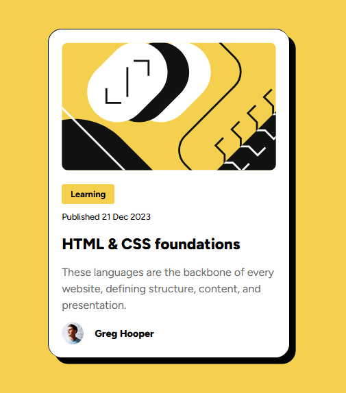
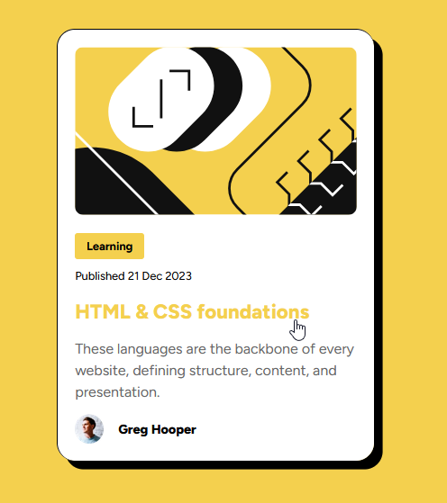

# Frontend Mentor - Blog preview card solution

This is a solution to the [Blog preview card challenge on Frontend Mentor](https://www.frontendmentor.io/challenges/blog-preview-card-ckPaj01IcS).

## Table of contents

- [Overview](#overview)
  - [The challenge](#the-challenge)
  - [Screenshot](#screenshot)
  - [Links](#links)
- [My process](#my-process)
  - [Built with](#built-with)
  - [What I learned](#what-i-learned)
- [Author](#author)

## Overview

### The challenge

Users should be able to:

- See hover and focus states for all interactive elements on the page

### Screenshot

Hover State:

### Links

- Live Site URL: [Add live site URL here](https://your-live-site-url.com)

## My process

### Built with

- HTML
- CSS / Flexbox

### What I learned

I have always linked fonts externally, and never used fonts from my device. I learned that it is just as easy to link local fonts as it is external. Also, at the beginning of this challenge I could not grasp the difference between `:focus` and `:active` states. [I found a great answer with an example on Stack Overflow!](https://stackoverflow.com/questions/1677990/what-is-the-difference-between-focus-and-active).

## Author

- Frontend Mentor - [@bsd-rgb](https://www.frontendmentor.io/profile/bsd-rgb)
